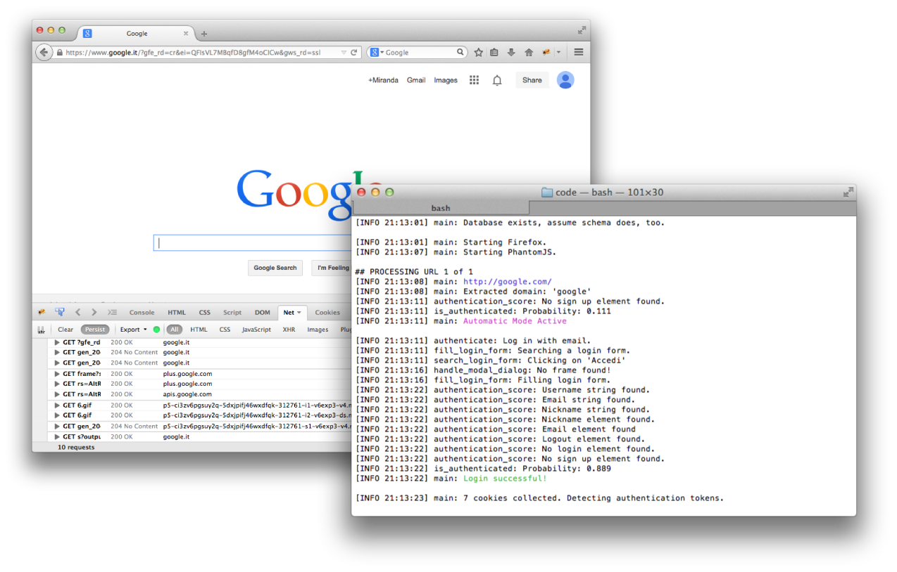

# authtokens
authtokens is a [Selenium](http://www.seleniumhq.org/ "selenium")-based tool, written in **Python**, for detecting authentication tokens.

---

## Usage Example

	python detect_tokens.py -i http://example.com -u username -m mail@foo.com -n nickname

## Requirements
* [Firefox](https://www.mozilla.org/ "firefox")
* [PhantomJS](http://www.phantomjs.org/ "phantomjs")

## Dependencies
* selenium (>= 2.44)
* beautifulsoup4 (>= 4.3.2)

## License
authtokens is licensed under the [MIT License](http://opensource.org/licenses/MIT).

## References
1. Calzavara, Stefano, et al. "Quite a mess in my cookie jar!: leveraging machine learning to protect web authentication." Proceedings of the 23rd international conference on World wide web. International World Wide Web Conferences Steering Committee, 2014.
